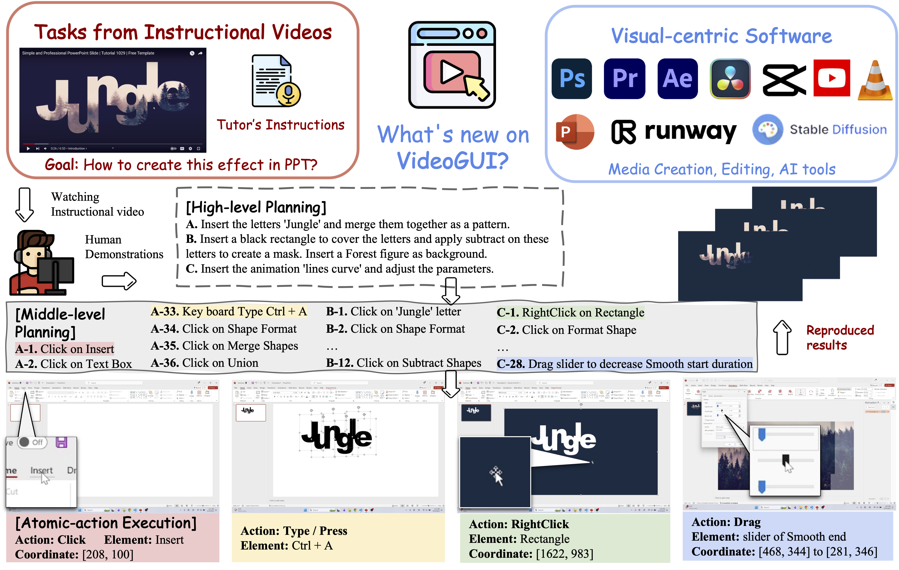

# [VideoGUI: A Benchmark for GUI Automation from Instructional Videos]([https://showlab.github.io/videogui/](https://arxiv.org/abs/2406.10227))
[Kevin Qinghong Lin](https://qinghonglin.github.io/), [Linjie Li](https://scholar.google.com/citations?user=WR875gYAAAAJ&hl=en), [Difei Gao](https://scholar.google.com/citations?user=No9OsocAAAAJ&hl=en), Qinchen Wu,
Mingyi Yan, [Zhengyuan Yang](https://zyang-ur.github.io/), [Lijuan Wang](https://www.microsoft.com/en-us/research/people/lijuanw/), [Mike Zheng Shou](https://sites.google.com/view/showlab)

[](https://showlab.github.io/videogui/)


## 📢 News
- [2025.6] We release all metadata and human recording at [Google-Drive](https://drive.google.com/file/d/13bjnIQhhEUe9eX07YwIdWGnNskVmTUc5/view).
- [2024.6] We release the arXiv paper.
- [2024.9] Accepted by NeurIPS 2024 D&B.
- [2024.10] We released the data at [Huggingface dataset](https://huggingface.co/VideoGUI). Please stay tuned for further updates.

## 📝 TODO
- [ ] Upload the Evaluation code and metric implementation.
- [x] Upload the Missed metadata.

## 📖 Introduction
> **TL;DR:** A Multi-modal Benchmark for Visual-centric GUI Automation from Instructional Videos.



**Visual-centric softwares and tasks:** VideoGUI focuses on professional and novel software like PR and AE for video editing, or Stable Diffusion and Runway for visual creation. Besides, the task query emphasizes visual preview rather than textual instructions.

**Instructional videos with human demonstration:** We source novel tasks from high-quality instructional videos, with annotators replicating these to reproduce effects.

**Hierarchical planning and actions:** We provide detailed annotations with planning procedures and recorded actions for hierarchical evaluation.

## 📂 Data Structure [Google-Drive](https://drive.google.com/file/d/13bjnIQhhEUe9eX07YwIdWGnNskVmTUc5/view)
```
VideoGUI/
└── DaVinci/  # software
    └── DV_8/  # task
        └── keylog/  # recording
            ├── 2024-05-27_11-02-22-126188/  # mid-level
            ├── 2024-05-27_11-03-06-590299/
            ├── 2024-05-27_11-30-30-996960/
            └── 2024-05-27_11-05-04-143397/
```

Each task directory contains:
- The start or end frame, whether an image or a video, serves as the visual query.
- The project file such as `.drp` for DaVinci.

Each mid-level directory contains:
- an `.mkv` video file, which is the screen recording
- a `_full.json` file that stores the corresponding action metadata.
- `arranged/` directory, which store the screenshot in order.

## 🔨 Online Environment
If you want to set up the online environment, refer to the tutorial by [GUI-Thinker](https://github.com/showlab/GUI-Thinker).

## 🎓 BibTeX
If you find our work helpful, please kindly consider citing our paper. Thank you!
```
@inproceedings{linvideogui,
  title={VideoGUI: A Benchmark for GUI Automation from Instructional Videos},
  author={Lin, Kevin Qinghong and Li, Linjie and Gao, Difei and Qinchen, WU and Yan, Mingyi and Yang, Zhengyuan and Wang, Lijuan and Shou, Mike Zheng},
  booktitle={The Thirty-eight Conference on Neural Information Processing Systems Datasets and Benchmarks Track}
}
```
